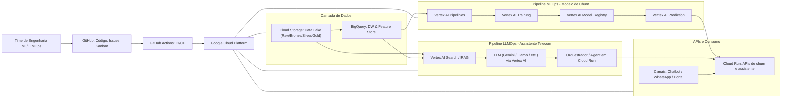

# 📡 Projeto: Plataforma MLOps + LLMOps para Telecom

**Modelos: Churn Prediction + Assistente LLM Telecom (RAG + Automação)**
**Stack: Google Cloud + GitHub + GitHub Actions + Vertex AI**

---

## 🧭 Visão Geral do Projeto

Este repositório contém um projeto completo e integrado de **MLOps** e **LLMOps** utilizando **Google Cloud Platform** como infraestrutura principal.
O projeto simula um cenário real de cliente do setor **Telecomunicações**, incluindo:

* Um **modelo de Machine Learning** para prever **churn** (cancelamento)
* Um **Assistente LLM inteligente para suporte de telecom**, usando RAG, conectores e automações
* Pipelines de CI/CD, deploy automatizado, versionamento, monitoramento e boas práticas

O objetivo é **estudar**, **aprender**, **treinar**, e **reproduzir em ambiente real** práticas de engenharia usadas pelas grandes empresas de tecnologia.

---

# 🌐 Arquitetura Geral (Mermaid)



---

# 🧩 Componentes do Projeto

### **1. MLOps – Modelo de Churn**

Inclui:

* Ingestão de dados (BSS, CRM, redes, CSVs)
* Data Lake (GCS)
* Data Warehouse (BigQuery)
* Feature Store (BigQuery)
* Pipeline de treinamento (Vertex Pipelines)
* Versionamento de modelos (Model Registry)
* Deploy Online e Batch (Vertex Predictions)
* Monitoramento de drift, métricas e logs

---

### **2. LLMOps – Assistente Inteligente Telecom**

Contém:

* Base RAG com documentos de telecom (FAQ, manuais, políticas internas)

* Embeddings e index via Vertex AI Search

* LLM (Gemini, Llama, Mistral – configurável)

* Orquestrador/Agente em Cloud Run

* Ferramentas (Tools) conectadas ao:

  * Modelo de churn
  * CRM
  * Regras de planos e ofertas
  * Diagnóstico de problemas de internet

* Observabilidade de LLM (logging, safety, evals automáticos)

---

### **3. CI/CD – GitHub Actions + Google Cloud**

Inclui:

* Validação automática de código
* Lint + Testes + Security checks
* Build & push de contêineres (Artifact Registry)
* Deploy para Cloud Run
* Update automatizado de pipelines (Vertex AI Pipelines)
* Registro automático de modelos aprovados

---

# 📂 Estrutura de Pastas Recomendada

```
telecom-ml-llmops/
│
├── mlops/
│   ├── pipelines/
│   ├── training/
│   ├── serving/
│   ├── monitoring/
│   └── tests/
│
├── llmops/
│   ├── prompts/
│   ├── rag/
│   ├── agent/
│   ├── tools/
│   └── evaluations/
│
├── infra/
│   ├── terraform/
│   ├── gcloud/
│   ├── networks/
│   └── iam/
│
├── data/
│   ├── sample/
│   └── schemas/
│
├── docs/
│   ├── architecture/
│   ├── mlops/
│   ├── llmops/
│   └── api/
│
└── .github/
    └── workflows/
        ├── ci.yml
        ├── cd-ml.yml
        ├── cd-llm.yml
        └── security.yml
```

---

# 🚀 Roadmap (6 semanas)

### **Semana 1 – Planejamento**

* Criar repositório GitHub
* Configurar Kanban
* Preparar estrutura inicial
* Provisionar Google Cloud

### **Semana 2 – MLOps: dados**

* Criar Data Lake e DW
* Criar features
* Criar pipeline inicial

### **Semana 3 – Treinamento e Deploy do modelo de churn**

* Training pipeline
* Avaliação e registro
* Deploy em Vertex Prediction

### **Semana 4 – LLMOps: RAG**

* Ingestão de documentos
* Criação do índice RAG
* Testes iniciais

### **Semana 5 – LLM Assistant**

* Criar agente
* Conectar churn ao LLM
* Criar APIs

### **Semana 6 – CI/CD & Observabilidade**

* GitHub Actions completo
* Alertas e dashboards
* Testes finais

---

# 🧠 Caso de Uso Principal (LLM em Telecom)

O projeto implementa um dos casos mais valorizados no mercado atual:

### **Assistente LLM de Suporte Técnico e Retenção para Telecom**

Capaz de:

* Diagnosticar problemas de internet
* Explicar fatura, cobranças, contratos
* Sugerir upgrades conforme perfil
* Detectar risco de churn via modelo ML
* Registrar atendimentos
* Integrar CRM, billing e regras comerciais

---

# 🛡️ Boas Práticas de Desenvolvimento

### **Organização e Fluxo de Trabalho**

* GitFlow simplificado (main + develop + feature-branches)
* Pull Requests obrigatórios
* Issues sempre vinculadas a PRs
* Documentação incremental por PR

---

### **Código e Qualidade**

* Linting (flake8, black, isort)
* Testes unitários (pytest)
* Testes E2E para pipelines
* Post-mortems para falhas críticas

---

### **Infraestrutura**

* Tudo versionado (IaC – Terraform)
* Sem chaves expostas (OIDC GitHub → GCP)
* Logs e métricas obrigatórios em Cloud Monitoring

---

### **MLOps**

* Feature Store padronizada
* Drift detection ativo
* Versionamento de datasets e modelos
* Comparação de métricas para promoção de modelos

---

### **LLMOps**

* Prompts versionados em diretório dedicado
* Testes de regressão semântica (Vertex AI Evaluation)
* Políticas de segurança para LLM (moderação)
* Separação entre:

  * prompt de sistema
  * prompt de regras
  * prompt de contexto RAG

---

### **Documentação**

* Toda sprint gera documentação incremental
* Arquitettura → docs/architecture
* Pipelines → docs/mlops e docs/llmops
* APIs → docs/api

---

# 📝 Como Contribuir

1. Criar uma branch:

```
git checkout -b feature/nome-da-feature
```

2. Fazer commits pequenos e claros:

```
git commit -m "feat: adiciona pipeline de treinamento v1"
```

3. Abrir PR vinculada a uma Issue:

* Revisão entre engenheiros
* Checagens automáticas via GitHub Actions

4. Mesclar apenas após CI verde

---

# 📞 Contato e Suporte

**Time de Engenharia (Simulação de Cliente Telecom):**

* Engenheiro de Machine Learning
* Engenheiro de LLMOps

---

# 🎯 Objetivo Final do Projeto

Criar uma **plataforma de ML + LLM realmente profissional**, seguindo padrões industriais do Google Cloud, reprodutível em qualquer empresa, permitindo:

* Apresentar em portfólio
* Treinar equipes
* Construir MVPs de IA corporativa

---

